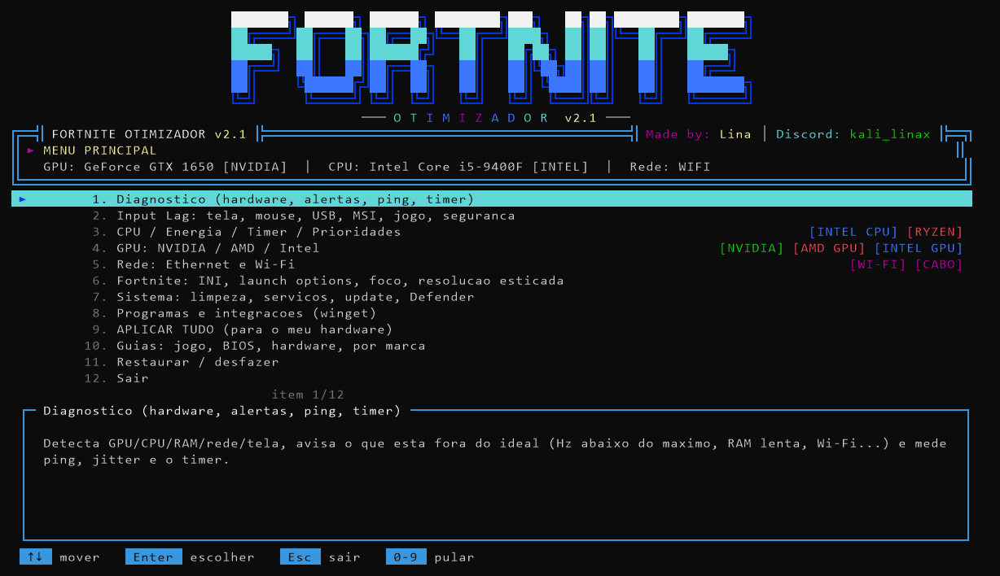
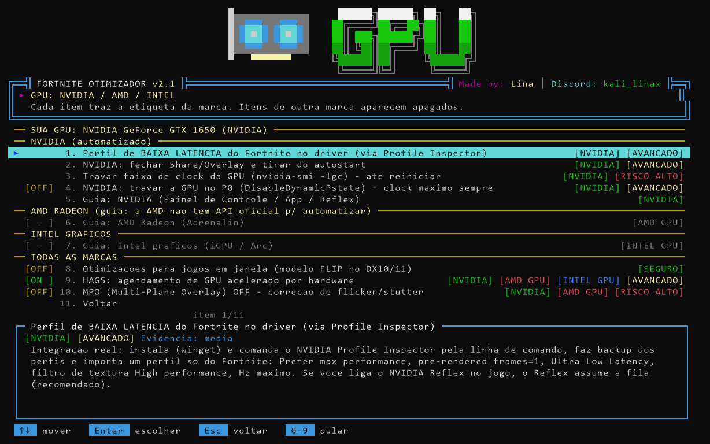
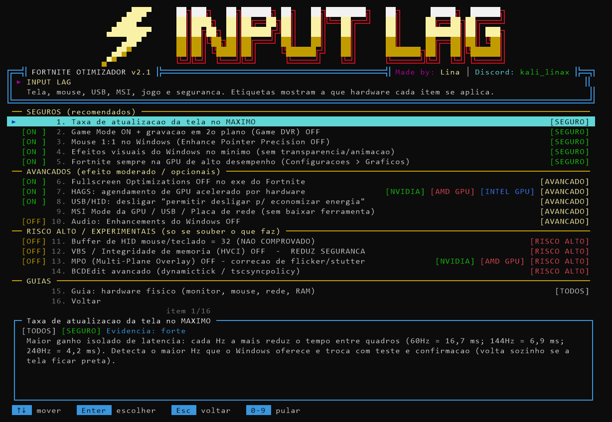
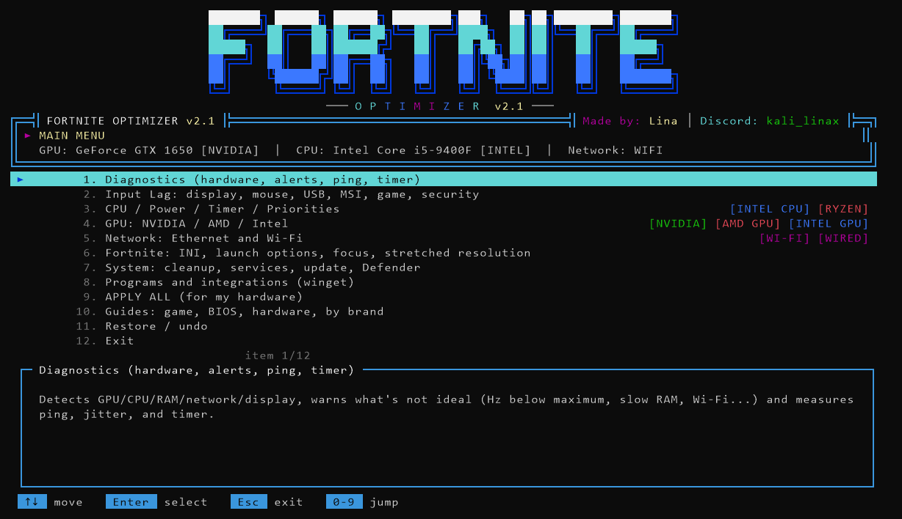

# Fortnite Otimizador

Script para Windows que ajusta o sistema para reduzir input lag e deixar o FPS mais estável no Fortnite. Funciona com placas NVIDIA, AMD e Intel. Ele detecta o hardware e mostra só o que se aplica a ele.

English version below: [English](#english).

## Download

Baixe o `Fortnite_Otimizador.bat` na página de [Releases](https://github.com/lirenzzzin/Fortnite-Optmizer/releases/latest). É um arquivo só, não precisa instalar.

## Como usar

1. Dê dois cliques no `.bat`. Ele pede permissão de administrador, necessária para mexer em energia, registro e rede.
2. Se o Windows mostrar "O Windows protegeu o computador", clique em Mais informações e depois em Executar assim mesmo. Esse aviso aparece para qualquer arquivo baixado sem assinatura digital. O código fica todo dentro do próprio `.bat` e pode ser lido em qualquer editor de texto.
3. Escolha o idioma (português ou inglês).
4. Navegue com as setas e Enter. Esc volta. Os números pulam direto para um item.

Sugestão para a primeira vez: abra o Diagnóstico, depois use Aplicar tudo (seguro) e reinicie o PC.

Para ver o que ele faria sem alterar nada, rode pelo terminal com `-DryRun`. Com `-Language pt` ou `-Language en` a tela de idioma é pulada.

## O que tem em cada menu

- Diagnóstico: resumo do hardware e alertas (RAM em canal único ou sem XMP/EXPO, tela abaixo do Hz máximo, Wi-Fi, driver de chipset AMD ausente, microcode antigo em Intel de 13ª/14ª geração, programas de overlay abertos). Também mede ping e jitter até os servidores da Epic.
- Input Lag: taxa de atualização máxima, Game Mode, economia de energia do USB, MSI mode, fullscreen optimizations, HAGS, VBS, MPO e BCDEdit.
- CPU / Energia: plano de energia criado conforme o processador (Intel comum, Intel com núcleos P e E, Ryzen, Ryzen X3D com dois CCDs), timer do Windows e prioridade do jogo. O plano pode ser exportado e importado como `.pow`.
- GPU: perfil de baixa latência só para o Fortnite na NVIDIA, aplicado pelo NVIDIA Profile Inspector com backup dos perfis. Para AMD e Intel há guias, porque essas marcas não oferecem uma forma oficial de aplicar as opções por script.
- Rede: configurações do adaptador, DNS, TCP e reset de rede.
- Fortnite: preset de desempenho no `GameUserSettings.ini`, resoluções esticadas, opções de inicialização, modo foco e replays.
- Sistema: limpeza, serviços, pausa do Windows Update e exclusões do Defender.
- Programas: instala e abre pelo winget ferramentas como CapFrameX, LatencyMon, HWiNFO, ISLC, Process Lasso, DDU e CRU.
- Guias: configurações dentro do jogo, BIOS, NVIDIA, AMD, Intel, rede e uma lista de tweaks populares que não funcionam.

Cada item informa a que hardware se aplica, o nível de risco (seguro, avançado ou alto) e o que há de evidência de que funciona. Alguns itens são mantidos mesmo com evidência fraca, e isso aparece escrito na descrição deles.

| | |
|---|---|
|  |  |

## Desfazer

Antes de alterar qualquer valor, o original é salvo em `Desktop\Fortnite_Otimizador_Backup`. O menu Restaurar volta registro, plano de energia, rede, arquivos INI e serviços para o estado anterior. O Aplicar tudo cria um ponto de restauração do Windows e não inclui itens de risco alto.

O script não injeta nada no jogo. Dos arquivos do Fortnite, ele só altera os de configuração (`GameUserSettings.ini` e `Engine.ini`), e apenas quando você escolhe esses itens.

## Requisitos

- Windows 10 ou 11, 64 bits
- PowerShell 5.1 (já vem no Windows)
- Conta de administrador
- Internet apenas para instalar os programas opcionais

## Créditos

Made by: Lina. Discord: kali_linax.

Licença MIT, sem garantia. Não é afiliado à Epic Games; Fortnite é marca registrada da Epic Games, Inc.

---

## English

Windows script that tunes the system to lower input lag and steady the frame rate in Fortnite. It works with NVIDIA, AMD and Intel graphics, detects your hardware and only shows what applies to it. The interface is available in English (chosen on the first screen).

Download `Fortnite_Otimizador.bat` from [Releases](https://github.com/lirenzzzin/Fortnite-Optmizer/releases/latest) and double-click it. It asks for administrator rights. If Windows shows "Windows protected your PC", click More info, then Run anyway; the warning appears for any unsigned download, and the full source is inside the `.bat`.

Use the arrow keys and Enter; Esc goes back. A good first run is Diagnostics, then Apply all (safe), then a restart. Run it with `-DryRun` to see what it would do without changing anything, or with `-Language en` to skip the language screen.

Every original value is saved to `Desktop\Fortnite_Otimizador_Backup` before it changes, and the Restore menu puts it back. Apply all creates a Windows restore point and skips high-risk items. Each item lists the hardware it targets, its risk level and how good the evidence behind it is.

Requires Windows 10 or 11 (64-bit), PowerShell 5.1 and an administrator account.

Made by: Lina. Discord: kali_linax. MIT license, no warranty. Not affiliated with Epic Games.
